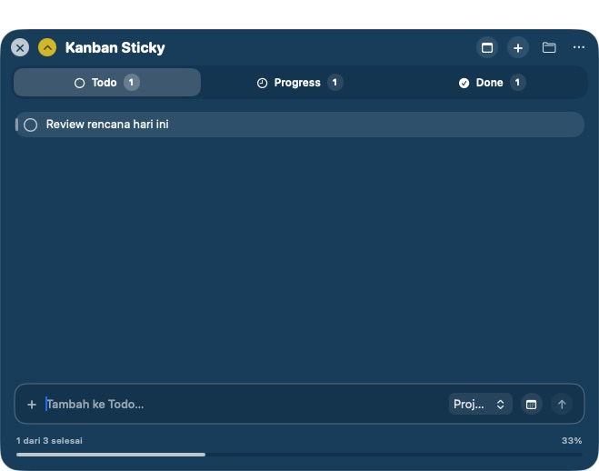
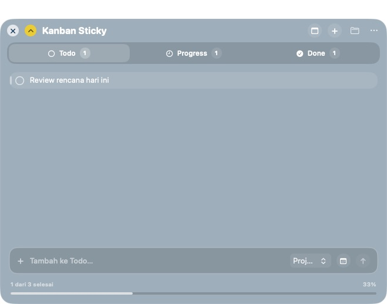
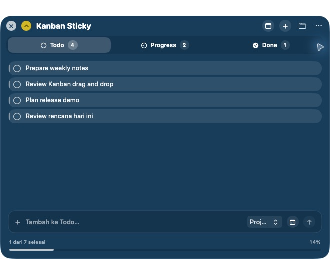
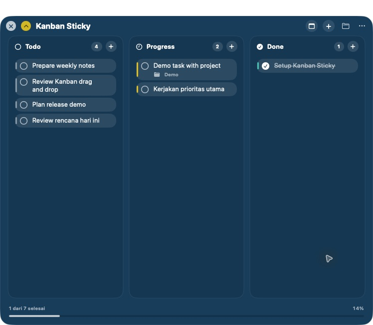
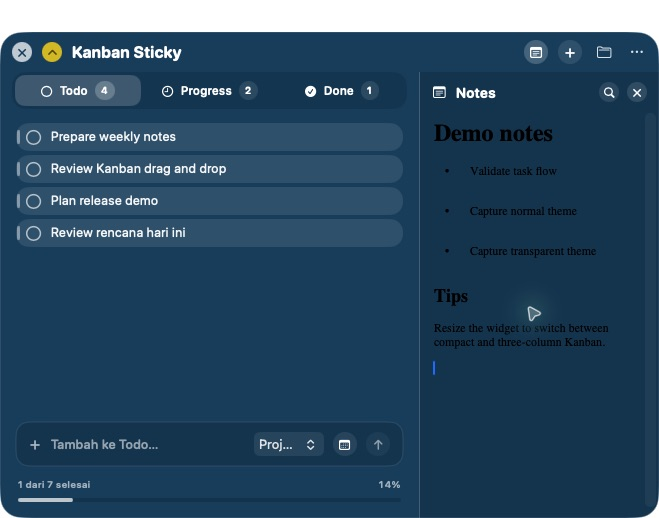
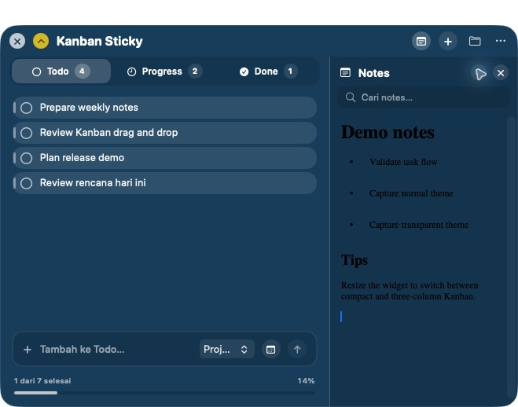
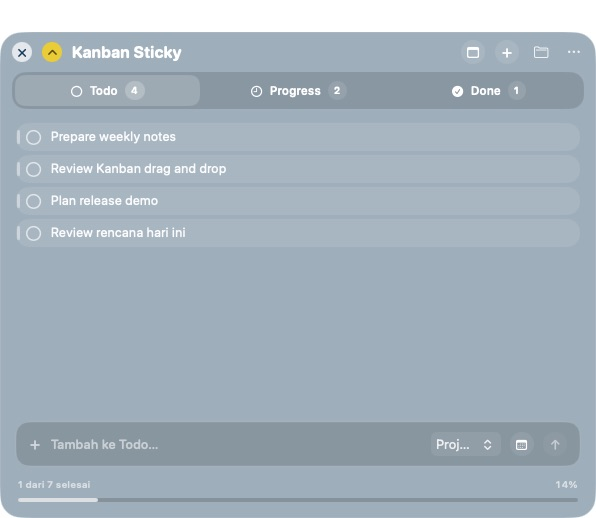
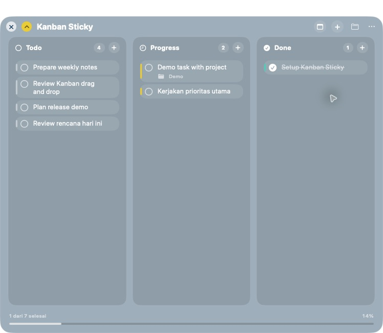
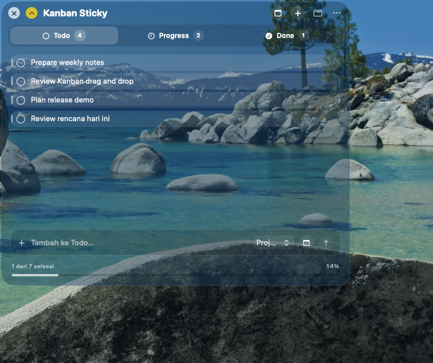
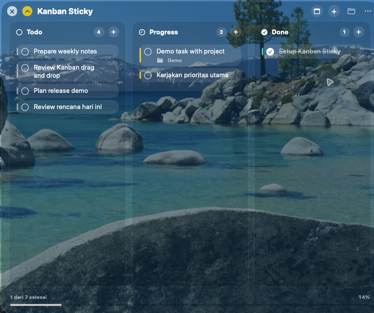

# Kanban Sticky

Widget kanban floating untuk macOS dengan kolom Todo, Progress, dan Done.

## Menjalankan

Klik dua kali `build-and-run.sh`, atau jalankan dari Terminal:

```sh
./build-and-run.sh
```

Task disimpan otomatis di Mac menggunakan UserDefaults. Arahkan pointer ke sebuah task untuk memindahkan atau menghapusnya. Klik lingkaran di kiri task untuk langsung menandainya selesai.

Tarik tepi atau sudut widget untuk mengubah ukurannya. Saat lebarnya mencapai sekitar 720 px, tampilan otomatis berubah menjadi papan tiga kolom. Dalam mode ini, drag sebuah task lalu drop ke kolom Todo, Progress, atau Done.

Ukuran dan posisi terakhir widget diingat otomatis saat aplikasi dibuka kembali.

Shortcut `Command + W` menyembunyikan widget. Jalankan aplikasinya lagi dari `~/Applications/Kanban Sticky.app` untuk menampilkannya kembali.

## Menu bar

Ikon checklist di menu bar dapat digunakan untuk menampilkan atau menyembunyikan widget, membuka input task berdasarkan status, melihat jumlah task, dan keluar dari aplikasi.

Kanban Sticky otomatis membuat Login Agent saat pertama kali dijalankan. Setelah itu aplikasi terbuka otomatis setiap kali pengguna login ke macOS dan langsung tersedia di menu bar.

## Membuat installer

Jalankan `./create-installer.sh`. Installer DMG akan dibuat di folder `dist` dan berisi aplikasi beserta shortcut ke folder Applications.

## Preview

Tema normal:



Tampilan Kanban:


Tema transparan:



Video walkthrough:

[Lihat video walkthrough Kanban Sticky](docs/kanban-sticky-walkthrough.mov)

### Capture fitur dengan data contoh

Capture berikut dibuat memakai data contoh sementara. Data pengguna dibackup sebelum proses capture dan dipulihkan kembali setelah selesai.

Papan compact dan wide pada tema normal:





Notes dapat ditampilkan di samping kanban dan memiliki pencarian:





Filter project dan daftar project terdaftar digunakan pada task contoh di walkthrough.

Tema transparan mempertahankan latar desktop di belakang widget, pada beberapa ukuran:









Walkthrough interaktif (task contoh, toggle Notes, pencarian, resize, dan pergantian tema):

[Lihat video walkthrough sample](docs/kanban-sticky-walkthrough-sample-crop.mov)
